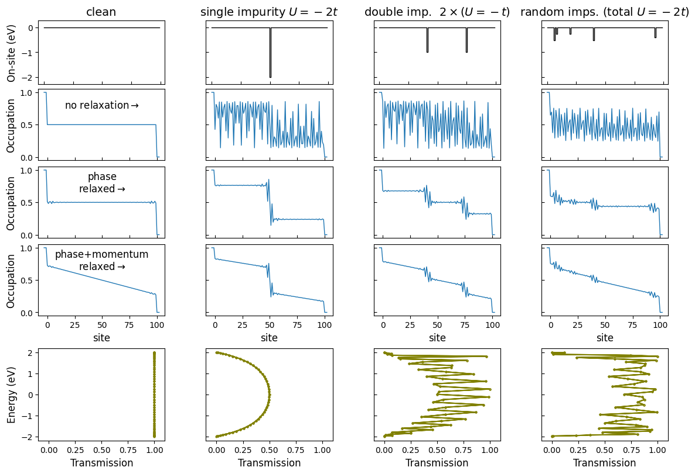

Non-Equillibrium Green's Functions solvers and examples for educational purposes. Limited to a 1D linear chain for now.
See the [documentation](https://liborsold.github.io/fuNEGF/).

Install with 
```
pip install fuNEGF
```
from the [project's PyPI repository](https://pypi.org/project/fuNEGF/).

## Structure
* the ```LinearChain``` class including the NEGF routines resides in ```src/fuNEGF/models.py```
* a Jupyter notebook ```examples/one-dimensional_channel.ipynb``` contains the linear chain case study with the underlying physics explained
* a Jupyter notebok ```examples/time_complexity.ipynb``` contains a time complexity study of constructing the model $\mathcal{O}(N)$ and calculating the transmission coefficient $\mathcal{O}(N^2)$

## Example
A linear chain with a single or multiple on-site potential impurities will present a chemical potential (occupation) drop, which may not be apparent unless a phase relaxation is included, as shown below.
An additional momentum relaxation will cause a non-zero chemical potential slope in between the impurity regions.
The complete description and calculation are provided in the ```examples/one-dimensional_channel.ipynb``` notebook.



## Features
* object-oriented
* PEP8-compliant
* including unit tests (limited for now)
* with automatically generated [documentation online](https://liborsold.github.io/fuNEGF/)


## The Theory In A Nutshell

### NEGF

The *retarded Green's function*

$$
\mathbf{G}^{\mathrm{R}}=[E \mathbf{I}-\mathbf{H}-\mathbf{\Sigma}]^{-1}
$$

along with the *advanced Green's function*

$$
    \mathbf{G}^{\mathrm{A}} = \left[ \mathbf{G}^{\mathrm{R}} \right]^\dagger
$$

provide the *spectral function*

$$
\mathbf{A}=i\left[\mathbf{G}^{\mathrm{R}}-\mathbf{G}^{\mathrm{A}}\right]
$$

and are used to solve for the *"electron occupation" Green's function*

$$
\mathbf{G}^{\mathrm{n}}=\mathbf{G}^{\mathrm{R}} \mathbf{\Sigma}^{\mathrm{in}} \mathbf{G}^{\mathrm{A}}
$$

which gives the *density matrix* 

$$
    \hat{\rho} = \mathbf{G}^{\mathrm{n}} / 2\pi .
$$


Both, the self-energy $\mathbf{\Sigma}$ and the in-scattering term $\mathbf{\Sigma}^{\mathrm{in}}$ are sums of the left contact $\mathbf{\Sigma_1}$, right contact $\mathbf{\Sigma_2}$ and an intrinsic term $\mathbf{\Sigma_0}$, hence

$$ \begin{align}
        \mathbf{\Sigma}^{\mathrm{in}} &= \mathbf{\Sigma}^{\mathrm{in}}_1 + \mathbf{\Sigma}^{\mathrm{in}}_2 , \\
        \mathbf{\Sigma} &= \mathbf{\Sigma}_1 + \mathbf{\Sigma}_2 + \mathbf{\Sigma}_0 .
   \end{align}        
$$

NOTE: We use the (physically expressive) notation of S. Datta, where the self-energies and Green's functions in relation to the standard notation (on the right) are defined as  

$$
\begin{align}
    \mathbf{\Sigma} &\equiv \mathbf{\Sigma}^\mathrm{R} , \\
    \mathbf{G}^\mathrm{n} &\equiv -i \mathbf{G}^< , \\
    \mathbf{\Sigma}^\mathrm{in} &\equiv -i \mathbf{\Sigma}^< .
\end{align}
$$

### Linear Chain Model

For the ```LinearChain``` model, the Hamiltonian

$$
\hat{H}_{ij} = \begin{cases}
            \epsilon_0, & \text { if } i=j \\ 
            t, & \text{ if } i \neq j 
        \end{cases}
$$

Impurity can be added to the on-site energy as 
$$ \hat{H}=\left[\begin{array}{ccccc}
\ddots & \vdots & \vdots & \vdots & \ddots \\
\cdots & \varepsilon & t & 0 & \cdots \\
\cdots & t & \varepsilon+U & t & \cdots \\
\cdots & 0 & t & \varepsilon & \cdots \\
\ddots & \vdots & \vdots & \vdots & \ddots
\end{array}\right]
$$

The linear chain **self-energies**

$$
\Sigma_1=\left[\begin{array}{ccccc}
\mathrm{te}^{i k a} & 0 & 0 & \cdots & 0 \\
0 & 0 & 0 & \cdots & 0 \\
0 & 0 & 0 & \cdots & 0 \\
\vdots & \vdots & \vdots & \ddots & \vdots \\
0 & 0 & 0 & \cdots & 0
\end{array}\right], \quad \Sigma_2=\left[\begin{array}{ccccc}
0 & \cdots & 0 & 0 & 0 \\
\vdots & \ddots & \vdots & \vdots & \vdots \\
0 & \cdots & 0 & 0 & 0 \\
0 & \cdots & 0 & 0 & 0 \\
0 & \cdots & 0 & 0 & \mathrm{te}^{i k a}
\end{array}\right]
$$

with the broadening functions $\Gamma \equiv i\left[ \Sigma - \Sigma^\dagger\right] $ 

$$
\Gamma_1=\frac{\hbar v}{a}\left[\begin{array}{ccccc}
1 & 0 & 0 & \cdots & 0 \\
0 & 0 & 0 & \cdots & 0 \\
0 & 0 & 0 & \cdots & 0 \\
\vdots & \vdots & \vdots & \ddots & \vdots \\
0 & 0 & 0 & \cdots & 0
\end{array}\right], \quad \Gamma_2=\frac{\hbar v}{a}\left[\begin{array}{ccccc}
0 & \cdots & 0 & 0 & 0 \\
\vdots & \ddots & \vdots & \vdots & \vdots \\
0 & \cdots & 0 & 0 & 0 \\
0 & \cdots & 0 & 0 & 0 \\
0 & \cdots & 0 & 0 & 1
\end{array}\right]
$$

where $v=\mathrm{d} E /(\hbar \mathrm{d} k) = -2 a t / \hbar \sin (k a)$ so that $\frac{\hbar v}{a} = -2 t / \sin (k a)$.

The in-scattering terms

$$
\Sigma^\mathrm{in}_i = \Gamma_i \cdot f_i ,
$$

 where $f_i$ is the Fermi-Dirac distribution function for contact $i$.

The self-energies describing the phase and momentum relaxation are defined in terms of the *Green's function itself*. The relaxation strength is defined via the (scalar) coefficients $D_0^\text{phase}$ and $D_0^\text{phase-momentum}$, defining a "mask"

$$
        \mathbf{D} = D_0^\text{phase} 
        \left[\begin{array}{ccccc}
1 & 1 & 1 & \cdots & 1 \\
1 & 1 & 1 & \cdots & 1 \\
1 & 1 & 1 & \cdots & 1 \\
\vdots & \vdots & \vdots & \ddots & \vdots \\
1 & 1 & 1 & \cdots & 1
\end{array}\right]
        + D_0^\text{phase-momentum}
        \left[\begin{array}{ccccc}
1 & 0 & 0 & \cdots & 0 \\
0 & 1 & 0 & \cdots & 0 \\
0 & 0 & 1 & \cdots & 0 \\
\vdots & \vdots & \vdots & \ddots & \vdots \\
0 & 0 & 0 & \cdots & 1
\end{array}\right]
$$

and performing an element-wise matrix multiplication

$$
\begin{align}
        \mathbf{\Sigma}_0 &= \mathbf{D} \odot \mathbf{G}^\text{R}, \\
        \mathbf{\Sigma}^\text{in}_0 &= \mathbf{D} \odot \mathbf{G}^\text{n} ,
\end{align}
$$

therefore a self-consistent loop is performed, where $\mathbf{G}^\text{R}$ and $\mathbf{G}^\text{n}$ are initially set as zero matrices and iteratively updated. About 70 iteration steps are usually enough to reach a convergence.