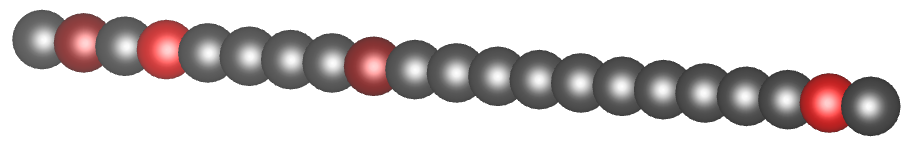

.. fuNEGF documentation master file, created by
   sphinx-quickstart on Tue Apr  9 17:51:34 2024.
   You can adapt this file completely to your liking, but it should at least
   contain the root `toctree` directive.

==================================
Welcome to fuNEGF's documentation!
==================================

The `fuNEGF project <https://github.com/liborsold/fuNEGF/>`_ is a Python package for the calculation of the electronic transport properties of nanostructures using the Non-Equilibrium Green's Function (NEGF) formalism for educational purposes. Limited to a 1D linear chain for now.

Quickstart
================

.. code-block:: python
   
   pip install fuNEGF

then 

.. code-block:: python
   
   git clone https://github.com/liborsold/fuNEGF.git
   
and execute the ``./examples/one-dimensional_channel.ipynb`` Jupyter notebook to see an example of calculating the NEGF transmission and chemical potential in the presence of impurities.

.. fuNEGF example image

.. fuNEGF example image
.. image::
   ./_images/example_fuNEGF.png
   :width: 650px
   :align: center

From the occupation it is clear that each impurity acts as a quantum resistor, causing a drop in the chemical potential. Without phase relaxation, however, it might be difficult to see. Momentum relaxation distributes the potential drop also into the clean wire region, causing a linear drop. 

The transmission function is reduced due to strong localized impurities from the clean limit :math:`T(E) = 1.0 = \mathrm{const.}` to half of its value. With many weak and randomly distributed impurities, the transmission starts to resemble the clean limit again.

Navigation
==========

.. toctree::
   :maxdepth: 3

   theory
   example
   modules
   classes

Indices and tables
==================

* :ref:`genindex`
* :ref:`modindex`
* :ref:`search`
